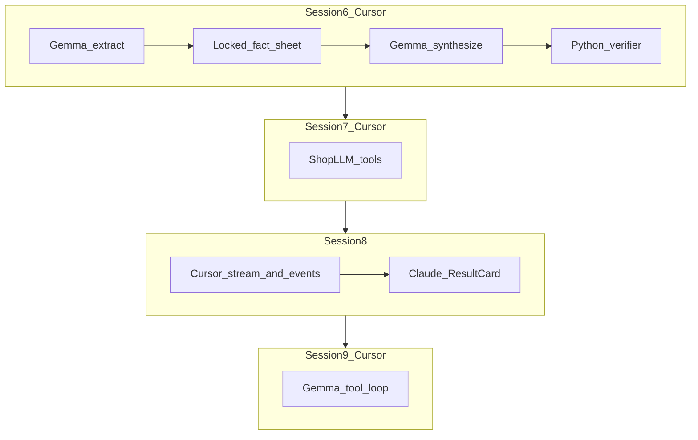

# Voice AGI — Gemma 4 / General Compute plan

**Superseded for “build everything”:** use [`docs/voice-agi-spec.md`](voice-agi-spec.md) (one builder, server + UI). This file keeps the Cursor / Claude split.

Multi-session, multi-agent. Continues [`docs/multi-agent-plan.md`](multi-agent-plan.md) Sessions 1–5.

**Who takes work (only these two):**

| Who | Owns | Does not |
| --- | --- | --- |
| **Cursor** | `server/` only | `frontend/**` |
| **Claude Code** | UI only: streamed `why` on the existing result card | `server/`, new screens |

No other owners. No Mentra. Book stays a no-op.

**Why this track exists:** Heavy inference belongs on General Compute (`gemma-4-31B-it`). SerpAPI and Twilio stay the real world. Python only **verifies** dollars. Gemma **decides**.

```
speak → shops (SerpAPI) → call (Twilio + Gradium + Gemma turns)
  → extract (Gemma) → fat decision (Gemma) → verify (Python) → result card
```

**Model:** `gemma-4-31B-it` at `https://api.generalcompute.com/v1`. Do not switch to Gemma 3n or DeepSeek unless synthesize latency is bad after the fat prompt.

**Rules (every session):** Never invent a shop or a dollar. Tool results and transcripts are the only money. Demo dial stays `TWILIO_DEMO_TO` / +1 709 765 6030 until you lift that. Do not commit `.env`. One Cursor agent per row; do not have two Cursor agents edit the same file in the same session. Session N starts when Session N−1 **Done when** is true.

**Already in (do not rebuild):**

| Piece | Where |
| --- | --- |
| Live caller brain | `server/call_audio.py` `ShopLLM` |
| One-shot GC client | `server/llm.py` `complete()` + JSON schema |
| Planner / extract / synthesize prompts | `server/prompts/*.md` |
| Fat-pass **shape** + dollar verifier | `server/synthesize.py`, `prompts/synthesize.md` |
| `Result.tradeoffs` + ResultCard list | `server/models.py`, `frontend/src/components/ResultCard.tsx` |
| Live TTS token stream | ShopLLM → Gradium (already) |

**Gate:** Fat pass is empty until extract sees a real transcript. Session 6 Agent 3 is that gate.

---

## Parallel map

```
S6 (sheet + extract + JSON)  →  S7 (call tools)
  →  S8 (stream why: Cursor events + Claude card)
  →  S9 (orchestrator tools)
```

S6 is a real Gemma decision on **one** honest quote.  
S7 is Gemma **acting** on the phone.  
S8 is the judge-visible “inference landing on the card.”  
S9 is Gemma **ordering** SerpAPI, not inventing Maps.



---

## SESSION 6 — Fat decision pass (Cursor)

**Achieve:** One `llm.complete` sees every shop’s facts **and** short transcripts, returns options + recommendation + why + tradeoffs. Python verifies. One retry. Usage logged. Extract runs on persisted lines. JSON schema has a `json_object` fallback.

| Agent | Who | Builds |
| --- | --- | --- |
| 1 | Cursor | **Sheet.** `synthesize.py` user JSON: `shops`, `webParts`, `userQuote`, `preferences`, per-agent `transcript` (cap ~40 lines). Facts are the only money; transcript is for hassle / warranty wording. |
| 2 | Cursor | **Retry + usage + JSON.** Verifier fail → one follow-up listing dropped claims → deterministic fallback. Log `prompt_tokens`, `completion_tokens`, latency. If GC 400s on `json_schema`, use `json_object` + schema in the system prompt. Shared helper for planner / extract / synthesize. |
| 3 | Cursor | **Extract gate.** `_run_calls_then_complete` / hangup always runs `extract_facts` on `agent.transcript` (memory + `transcript_lines`). No lines → confidence 0, no invented facts. |
| 4 | Cursor | **Tests.** `test_synthesize.py`: extra shop dropped; `$400` + web part + labor → Gemma `why` only cites allowed dollars; retry with mock `complete`. |

**Done when:** A fixture (or one answered demo call) with all-in + labor + web part yields a result whose `why` came from Gemma and whose totals match Python (±$1).

**Files:** `server/synthesize.py`, `server/llm.py`, `server/orchestrator.py`, `server/extract.py`, `server/tests/test_synthesize.py`

---

## SESSION 7 — Call tools (Cursor)

**Achieve:** Gemma can **end the call** and **note a spoken field** via OpenAI-style tools. Turns stay short. Extract-at-hangup stays canonical.

| Agent | Who | Builds |
| --- | --- | --- |
| 1 | Cursor | **Schemas.** `note_fact(field, value)` and `end_call(reason)`. `field` ∈ allInPrice, partPrice, laborRatePerHour, laborHours, acceptsCustomerParts, partsType, warrantyMonths, earliestSlot. |
| 2 | Cursor | **ShopLLM loop.** `call_audio.py`: `tool_calls` → run in-process → `role: tool` → call again. Strip `stream_options` / `service_tier`. `max_tokens` ~80. |
| 3 | Cursor | **Side effects.** `note_fact` only if the value appears in the last business transcript line. `end_call` hangs up when eight fields are in, refuse, or voicemail. |
| 4 | Cursor | **Prompt.** `prompts/caller.md`: use tools instead of only saying goodbye. Never book. Never invent a number in a tool. |

**Done when:** After the last fact, Gemma calls `end_call` and the leg drops; a `note_fact` with a number not in the transcript is ignored.

**Files:** `server/call_audio.py`, `server/prompts/caller.md`, `server/llm.py` (optional shared tool-loop helper)

---

## SESSION 8 — Stream the why (Cursor + Claude)

**Achieve:** Synthesize streams tokens. The existing task screen shows why arriving, then verified `task.result` replaces it. Gradium TTS streaming unchanged. **No new UI screens.**

| Agent | Who | Builds |
| --- | --- | --- |
| 1 | Cursor | **`complete_stream`.** `llm.py` yields chunks (`stream: true`). Prefer `json_schema`; 400 → `json_object`. Parse full JSON at end for Session 6 verifier. |
| 2 | Cursor | **Events.** `result.partial` `{ taskId, whyDelta }` (or growing `why` on `task.updated`) before verify. After verify, existing `task.result`. |
| 3 | Cursor | **Wire.** Add `result.partial` to `TaskEvent` in `models.py`; coerce in `api.py`. |
| 4 | **Claude Code** | **`useTask` + ResultCard.** Append `whyDelta`. Show a live why line, then lock to verified result. Types in `frontend/src/types.ts`. Nothing else. |

**Done when:** Completing a task with a real sheet shows why text appear, then a stable card whose dollars still pass the verifier.

**Files (Cursor):** `server/llm.py`, `server/events.py`, `server/models.py`, `server/api.py`, `server/orchestrator.py`  
**Files (Claude):** `frontend/src/hooks/useTask.ts`, `frontend/src/types.ts`, `frontend/src/components/ResultCard.tsx`

Claude starts Agent 4 after Cursor Agents 1–3 have shipped the event. Cursor must not edit those frontend files.

---

## SESSION 9 — Orchestrator tool loop (Cursor)

**Achieve:** Gemma **orders** discovery and part lookup. It does not invent Maps hits or part prices. Dial stays single demo number unless you lift that later.

| Agent | Who | Builds |
| --- | --- | --- |
| 1 | Cursor | **Tools.** `discover_shops(lat, lng, query)` → `discovery.discover_shops`. `lookup_part(query)` → existing web lookup. Return name, phone, url, price only. |
| 2 | Cursor | **Loop.** `server/gc_loop.py`: `complete` with `tools` until a final message or **8 steps**. Orchestrator: plan → Gemma loop → insert agents from **tool results** → dial / extract / synthesize as today. |
| 3 | Cursor | **Guardrails.** Shop not in last `discover_shops` → drop. Part price not in `lookup_part` → drop. Step-cap → current orchestrator (plan → discover → web → dial). |
| 4 | Cursor | **Tests.** Mock tools: maps then part; agents match mock. Hallucinated ninth shop is not inserted. |

**Done when:** One Camry/Fremont task creates agents whose names/phones/part dollars equal SerpAPI (or mocks), and logs show Gemma `tool_calls` then `synthesize`.

**Files:** `server/gc_loop.py` (new), `server/orchestrator.py`, `server/discovery.py`, `server/web_agent.py`, `server/tests/test_gc_loop.py`

---

## File ownership (do not cross)

| Session | Cursor 1 | Cursor 2 | Cursor 3 | Cursor 4 / Claude |
| --- | --- | --- | --- | --- |
| 6 | `synthesize.py` + prompt | `llm.py` | `orchestrator.py` + extract persist | `tests/test_synthesize.py` |
| 7 | tool schemas (small module) | `call_audio.py` | hangup / facts side effects | `prompts/caller.md` |
| 8 | `llm.py` stream | events + orchestrator | `models.py` + `api.py` | **Claude:** `useTask` + ResultCard + types |
| 9 | tool wrappers | `gc_loop.py` | orchestrator + guards | `tests/test_gc_loop.py` |

---

## Out of scope (all sessions)

- A third product owner
- Cursor editing `frontend/**` except if Claude is unavailable for S8 Agent 4 — default is Claude
- Gemma 3n, DeepSeek, a second LLM
- Booking, accounts, Mentra
- Dialing real shop phones (unless you explicitly lift `single_demo_number`)
- Rebuilding Home / Task screens
- Invented shops, typical rates, price sheets

---

## Done for the whole track

A judge can submit the Camry prompt, see shops from SerpAPI, answer the demo call, watch Gemma ask / tool / hang up, see **why stream in**, then a result whose BYO vs shop-supplied numbers were **spoken or looked up**, with recommendation from Gemma 4 and Python proving the arithmetic.
